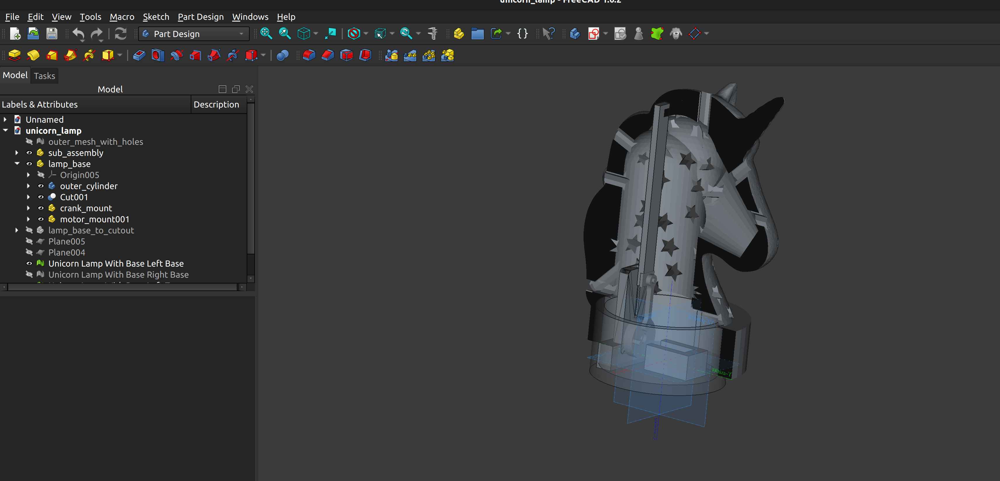
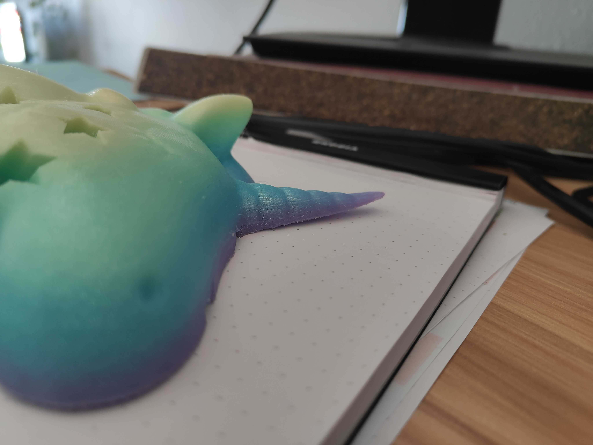

# Unicorn Night Light

This is the first time I've documented and open-sourced a weekend project!  

If this project is helpful, you can support future side quests ☕
https://buymeacoffee.com/GwenTheEngineer

## Idea
This project brings to life the following vision for a table-top night light.

* Unicorn shaped shell
* Star shaped holes (through which the light will project)
* Moves up and down .... but *not* in circles (to avoid the user getting dizzy)
* Preferably rainbow colored

## Conceptual Design

A back of the envelope sketch of the vision! Doesn't need to be perfect, just needs to communicate what we want to accomplish. 

## Research

### Printable Parts

First, I needed a mechanism that could convert angular movement to linear movement...but I didn't know the right word for it. So I googled. Turns out, the word is "crank". Then, because my CAD skills are pretty elementary, I searched by go-to resource (printables.com) for a model that would work as a starting point -- with some resizing and adjusting to accommodate the motor shaft.

### Electrical and Mechanical

My hardware-adjacent and hobby background helped here. I hopped on amazon to find a low speed motor, appropriate transformers and adapters, and some LEDs and heat sinks. The complete BOM is listed below.

Key considerations if you're shopping for your own parts:
* Motor size and speed -- I wanted something small (to fit inside) and low speed.
* Power supply -- wall sockets are AC; almost all hobby parts need DC
* Match voltages -- motor calls for 3.3-5V; you may need to step down your voltage after you transform AC-->DC
* Heat -- heat sinks help keep the temperature down. 

## Detailed Mechanical Design

### CAD

I'm an engineer, but not *this* kind of engineer (professionally, at least). I did play with meshes in grad school, and CAD for mechanical design as an undergrad, but I was rusty when I started this project.

### Tl;dr

* I used FreeCAD (https://www.freecad.org/), Blender  (https://www.blender.org/), and Tinkercad (https://www.tinkercad.com/)
* Blender for mesh coarsening (in order to import the unicorn head mesh into FreeCAD and Tinkercad)
* FreeCAD to create the primitives to hollow out the head
* Tinkercad for booleam operations (i.e., actually subtracting the hole from the shell; adding the star holes)
* FreeCAD to ensure mechanical fit of the crank parts and motor mount and extending the slider / attaching it to the outer unicorn head shell
* Tinkercad for final adjustments (adding a collar, subtracting the base, making the hole to attach the slider column to the unicorn shell)
* Blender to bisect the unicorn head in order to fit it on my printer (a Prusa Mini) -- See notes; this was a fun exercise but did not turn out to be necessary

### Play by Play
#### Outer Shell
Like most projects, this turned out to be more complicated than I had originally envisioned. (Engineers are notoriously bad at estimating).

Professional CAD tools are expensive. My favorite tool for small projects because it's very easy to use is tinkercad (online-only tool from the makers of AutoCad), free for individual and educational purposes.

For this project, that wouldn't work because the unicorn mesh was too big. After some research, I selected FreeCAD. Don't forget to leave a donation!

The big mesh was still causing problems, and free cads discretization didn't "just work". It's been a hot second, but I have used Blender for generating graphics for academic projects in the past. So I installed Blender, imported the mesh, used Blender's decimation tools, then went back to FreeCAD.  

After refining the mesh, I imported it back into FreeCad, then used primitives (cylinders, spheres, cones) to hollow out the unicorn head.

Next pain point was converting the unicorn shell to a solid in order to subtract the hole. FreeCAD recommends a max of 20k triangles; it was still too big (I tried to wait to let the CPU do it's thing, but it was hung)

But! Now I could import both parts into tinkercad and cut the hole out that way! So I decided to make the full shell in tinkercad, and return to FreeCAD (which I do want to learn) for the moving parts.

Back to FreeCAD to adapt the crank parts!

I imported the crank parts separately and "assembled" them for sense of scale. The general plan was to fit them in then scale the unicorn if necessary to make more room. I decided I would add mounts for the PCBs and LEDs later once all of the moving parts were put together. (Or, just wedge them in for now and come back to that in the next rev).

I needed one last import into free cad to cut the base out of the unicorn when all measurements were finalized. I scaled the unicorn up slightly from the original, and added a "cup" at the bottom to wedge PCBs and wires into.

One more round trop from FreeCAD Tinkercad to get the hole at the bottom correctly sized; I had to add a collar (I just did this in Tinkercad) to maintain the wall thickess.

Finally! I split the unicorn by planes (in FreeCAD) and went to plate it ... forgetting that I needed to have the edges filled (with the cutout, it's just 2 nested meshes.) CAD programs generally aren't great at mesh editing. Back to Blender.

This article was useful: https://blender.stackexchange.com/questions/338870/bisect-separate-move. Don't forget to select "Fill" when you're bisecting. 

I rearranged the resulting objects into 2 collections, and duplicated the new faces in each collection, then, I went back to object mode and joined all objects, and then back to merge the meshes by distance (this removed a few hundred vertices each time).

#### Finalizing the Crank
First, I cleaned up the original mesh by removing the tab meant to demonstrate the part manually. I did this in Blender, but probably could have converted to a solid in FreeCAD and made the updates there, since it's a pretty simple mesh. 

After the motors came in, I measured the shaft diameter at 3mm, with a flat face about 2mm wide. I then proceeded to accidentally use 3mm as the radius when updating the hole in the crank. F. This had to be redone. On the bright side I only had to fix the hole in the crank, because the default size for the part attached to the base was just about right (I'll file it down after it prints if it's an issue).

#### Finalizing the Base
We need to punch a hole for the power cord to go through!

#### Error Log (Learning!)

##### Printing Orientation

Initially I thought of printing the unicorn on its side for 2 reasons (1) to fit on the build plate and (2) to minimize support material not directly on the build plate; i.e. to avoid digging support material out of the unicorns nose. The unicorn's horn did not stick to the plate -- it lifted. Also, the filament I'm using is rainbow -- so printing each side separately would cause a weird discontinuity in the rainbow. Since I had to bisect the head twice (X and Z planes) to fit anyways, I might as well try printing from the bottom up.... back to Blender. I also adjusted the settings (angle) when computing necessary support material.

*I reduced the angle to 45 degrees and swapped to organic support (which is often easier to remove).*

##### Blender Hanging Splitting Loose Parts

The number of time Blender hung after bisect --> split faces by edges --> separate loose parts was frustrating. For some reason, it was trying to split ALL of the triangles into separate parts. This seemed to happen consistently when I bisected in the Z-plane (top from bottom) first.

In the end, I realized I could just print the whole unicorn, so went with this option (better for rainbow filament continuity).

The best work-around I found was duplicating the mesh and bisecting each instance; keeping the inner on one and outer on the other.

## Resources

### 3D Models

Crank Mechanism: https://www.printables.com/model/632627-crank-mechanism 

Unicorn Head: https://www.printables.com/model/1155402-unicorn-head

3D Printer: https://www.prusa3d.com/product/original-prusa-mini-semi-assembled-3d-printer-enclosure-bundle-5/

You don't actually need your own 3D printer; there is a growing number of public libraries, schools, and maker spaces where you can find them.

### Electrical Components BOM

These are affiliate links to fund a small percentage of reaching my Balmer peak (3-5% commission, depending on the part). Yay late stage capitalism. Let me know if you have a better resource and want to give Bezos less if your money.

As of this writing I have not tested any of these, so the list may change. I'll remove this comment when this is final.

* Low speed (tiny) motors: https://amzn.to/4qAXlMr
* LEDs: https://amzn.to/469XHT5
* Heat sinks: https://amzn.to/3ZFIS6Y
* DC PWM for motor or brightness control: https://amzn.to/46djYiJ
* DC Step down transformer: https://amzn.to/4tE2aY7
* Universal AC Adapter: https://amzn.to/4azepfL

## License

Unless otherwise noted, the documentation, images, and written content in this project are licensed under the Creative Commons Attribution-NonCommercial-ShareAlike 4.0 International License.

You are free to share and adapt this material for any non-commercial purpose, as long as you give appropriate credit.

## Disclaimer

This project is provided for educational and informational purposes only.

You assume all responsibility and risk for using the information, code, hardware designs, and instructions provided here. I make no guarantees regarding safety, reliability, or suitability for any purpose.

By attempting this project, you agree that I am not liable for any injury, damage, loss, or other issues that may occur as a result of building or using this project.

*Always follow proper safety practices when working with electronics, tools, and power sources.*
